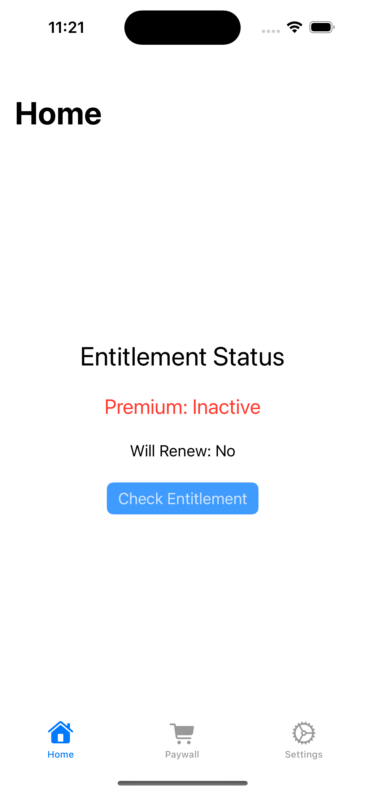
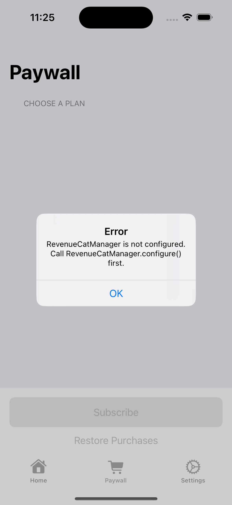
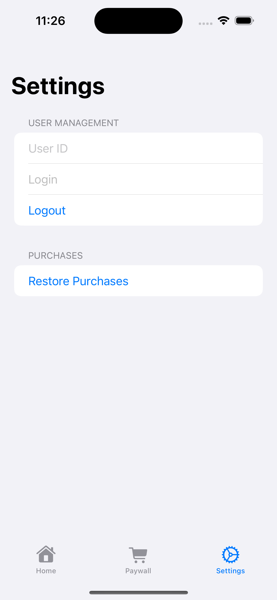

# iOS Example App

[English](README.md) | 日本語

`core` + `paywall-logic` モジュールの使い方を示す iOS サンプルアプリケーション（SwiftUI）。

## スクリーンショット

| Home | Paywall | Settings |
|:----:|:-------:|:--------:|
|  |  |  |

## セットアップ

### 1. RevenueCat ダッシュボードの設定

サンプルアプリを動作させるには、RevenueCat 側の設定が必要です。

#### 1-1. プロジェクト作成

1. [RevenueCat Dashboard](https://app.revenuecat.com) にログイン
2. 「Create new project」でプロジェクトを作成（Android と共有可能）
3. 「iOS app」を追加 → Bundle ID: `io.github.kwmt.revenuecat.example-ios`

#### 1-2. Entitlements 設定

1. Project Settings > Entitlements > 「New」
2. Identifier: `premium` で作成（コード内の `entitlementId` と一致させる）

#### 1-3. Products 登録

1. Project Settings > Products > 「New」
2. App Store Connect で作成したサブスクリプションの Product ID を登録
3. 作成した Entitlement (`premium`) に紐付け

#### 1-4. Offerings 設定

1. Project Settings > Offerings > Default Offering を編集
2. パッケージ（Monthly / Annual 等）を追加し、Products を紐付け

#### 1-5. API キーの取得

1. Project Settings > API Keys
2. **Public iOS API key** (`appl_xxx...`) をコピー

> **App Store Connect の設定について**
> Sandbox テストだけなら App Store Connect Shared Secret の設定は不要です。本番運用時は App Store Connect API Key を RevenueCat にアップロードしてください。

### 2. アプリ側の設定

1. KMP フレームワークをビルド:

```bash
./gradlew :paywall-logic:linkDebugFrameworkIosSimulatorArm64
```

2. `ExampleApp/Configuration.swift` に RevenueCat API キーを設定:

```swift
static let revenueCatAPIKey = "appl_xxxxxxxxxxxxx"
```

3. `ExampleApp.xcodeproj` を Xcode で開いてビルド・実行（CocoaPods は使いません）

## Sandbox テスト（実際の課金なし）

購入フローのテストは Apple の Sandbox 環境で行えます。**実際の課金は発生しません。**

### 方法 1: Xcode の StoreKit Testing（ローカル、推奨）

App Store Connect でのプロダクト設定不要で、ローカルで即座にテストできます。

1. Xcode で File > New > File > StoreKit Configuration File を作成
2. サブスクリプション商品を追加（Product ID は RevenueCat の Products と一致させる）
3. Scheme > Edit Scheme > Run > Options > StoreKit Configuration で作成したファイルを選択
4. シミュレータまたは実機で実行 → 購入ダイアログが表示される

### 方法 2: Sandbox テスターアカウント

App Store Connect の Sandbox 環境を使ったテストです。

#### テスターの作成

1. [App Store Connect](https://appstoreconnect.apple.com) を開く
2. Users and Access > Sandbox > Testers
3. 「+」でテスターアカウントを作成（実在しないメールアドレスでOK）

#### テスト手順

1. 実機の Settings > App Store > Sandbox Account でテスターアカウントにログイン
2. アプリをインストールして起動
3. Paywall 画面でパッケージを選択 → 「Subscribe」をタップ
4. Sandbox の購入ダイアログが表示される → パスワードを入力（課金なし）
5. 購入完了後、Home 画面で「Premium: Active」になることを確認

### 注意点

- **シミュレータ**: StoreKit Testing (方法 1) のみ使用可能。Sandbox アカウント方式は実機が必要
- RevenueCat ダッシュボードの「Sandbox data」トグルで Sandbox トランザクションを確認可能
- RevenueCat は自動的に Sandbox 環境を検知するため、特別な設定は不要

### 定期購入のテスト期間

Sandbox 環境では定期購入の更新サイクルが短縮されます：

| 本番期間 | テスト期間 |
|----------|-----------|
| 1週間 | 3分 |
| 1ヶ月 | 5分 |
| 2ヶ月 | 10分 |
| 3ヶ月 | 15分 |
| 6ヶ月 | 30分 |
| 1年 | 1時間 |

## 画面構成

| 画面 | 機能 | 使用API |
|------|------|---------|
| Home | Entitlement Status 表示、Check Entitlement | `RevenueCatClient.entitlementStatus` |
| Paywall | パッケージ一覧・選択・購入・リストア | `PaywallViewModel` |
| Settings | User ID 入力、Login/Logout、Restore | `RevenueCatClient.login/logout/restore` |

## 技術的な補足

- KMP StateFlow の監視には `FlowHelper` 経由のコールバックパターンを使用（SKIE 不要）
- RevenueCat iOS SDK は `purchases-kmp` 3.x が Kotlin のフレームワークに同梱する（0.0.8 から。`PurchasesHybridCommon` を足すと SDK が二重に入る）
- `paywall-logic` フレームワークが `export(project(":core"))` で core API も公開
