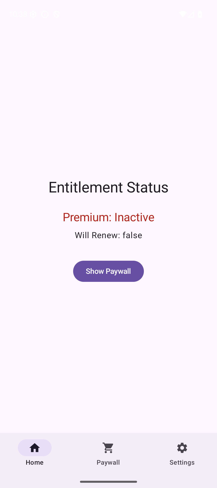
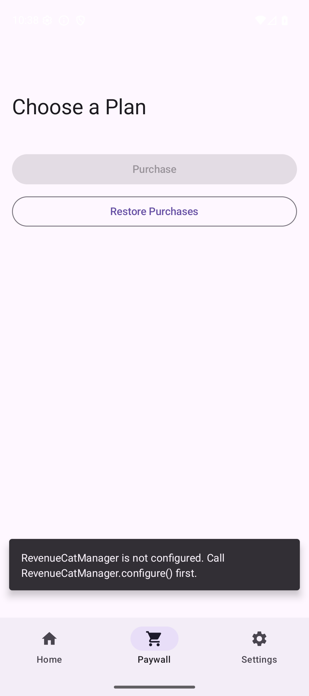
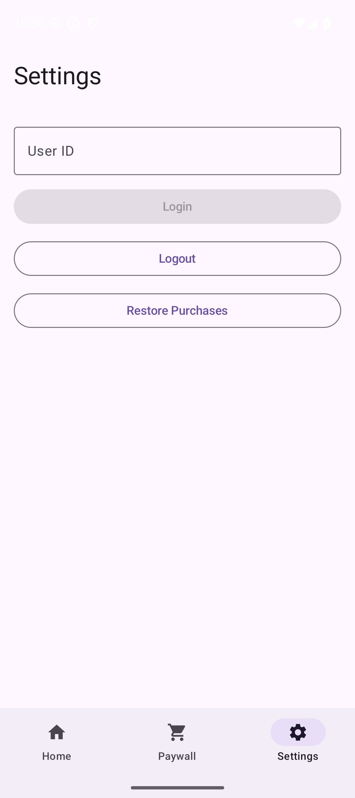

# Android Example App

`core` + `paywall-logic` モジュールの使い方を示す Android サンプルアプリケーション（Jetpack Compose）。

## スクリーンショット

| Home | Paywall | Settings |
|:----:|:-------:|:--------:|
|  |  |  |

## セットアップ

1. `local.properties` に RevenueCat API キーを設定:

```properties
revenuecat.apiKey=your_api_key_here
```

2. ビルド:

```bash
./gradlew :example:assembleDebug
```

## 画面構成

| 画面 | 機能 | 使用API |
|------|------|---------|
| Home | Entitlement Status 表示、Paywall 遷移 | `RevenueCatManager.entitlementStatus` |
| Paywall | パッケージ一覧・選択・購入・リストア | `PaywallViewModel` |
| Settings | User ID 入力、Login/Logout、Restore | `RevenueCatManager.login/logout/restore` |
